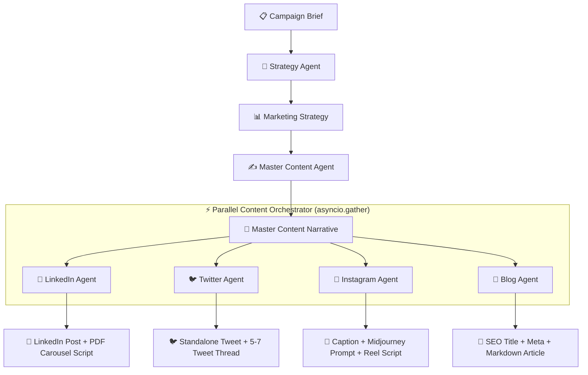

# ⚡ AI-Powered Social & Digital Content Generator

> An enterprise-grade, multi-agent AI marketing content engine that converts a single Campaign Brief into a unified Master Narrative, and orchestrates parallel generation of tailored assets across **LinkedIn**, **X/Twitter**, **Instagram**, and **Blog Articles**.

---

## 🌟 Key Features

- **Multi-LLM Provider Abstraction**: Seamlessly switch between **OpenAI** (`gpt-4o`), **Anthropic** (`claude-3-5-sonnet`), **Google Gemini** (`gemini-1.5-pro`), or `Mock` provider via configuration.
- **Structured Pydantic v2 Output**: Enforces strict JSON schemas with automatic self-repair retry loops.
- **4-Stage Sequential AI Workflow**:
  1. **Campaign Brief**: Input product, industry, target audience, personas, pain points, and offer.
  2. **Strategy Agent**: Produces audience insights, content pillars, key messaging, topics, and CTAs.
  3. **Master Content Agent**: Synthesizes strategy and brief into a platform-neutral core master narrative.
  4. **Content Orchestrator**: Executes **LinkedIn**, **Twitter**, **Instagram**, and **Blog** agents in parallel (`asyncio.gather()`).
- **Platform-Specific Generators**:
  - 💼 **LinkedIn**: Long-form structured posts & 5–7 slide PDF Carousel script cards.
  - 🐦 **X / Twitter**: Standalone post (<280 chars) & 5–7 tweet viral thread.
  - 📸 **Instagram**: Visual captions (10–15 hashtags), Midjourney `--ar 4:5` prompts, and Reel scripts.
  - 📝 **Blog**: SEO title, meta description, slug, target keywords, and Markdown article body.
- **Independent Single-Platform Regeneration**: Re-execute any individual platform asset without modifying others, with isolated database version tracking (`v1` → `v2` → `v3`).
- **In-Place Content Editing**: Inline text editing controls with instant saving and API update hooks.
- **Dark Glassmorphism UI**: High-contrast, responsive dashboard built with React 19, TypeScript, and custom Vanilla CSS design tokens.

---

## 🏗 System Architecture & Multi-Agent Flow



---

## 🛠 Tech Stack

### Backend
- **Framework**: Python 3.9+ / FastAPI
- **Database**: Async SQLAlchemy 2.0 with custom `GUID` cross-DB compatibility (PostgreSQL native UUID / SQLite CHAR36)
- **Migrations**: Alembic
- **Validation**: Pydantic v2 (`ConfigDict`, `Field` validation constraints)
- **Concurrency**: Python `asyncio` parallel execution
- **Testing**: `pytest` & `httpx` AsyncClient (48 passing tests)

### Frontend
- **Framework**: React 19 & TypeScript (Vite bundler)
- **Routing**: React Router DOM v7
- **Styling**: Vanilla CSS Design Tokens (Glassmorphic dark theme, CSS custom properties)

---

## 🚀 Quick Start Guide

### Prerequisites
- Python 3.9+
- Node.js 18+ & npm
- PostgreSQL (optional; SQLite fallback used automatically for local dev/test)

---

### 1. Backend Setup

```bash
cd backend

# Create virtual environment
python3 -m venv venv
source venv/bin/activate

# Install dependencies
pip install -r requirements.txt

# Copy environment template & configure API keys
cp .env.example .env
```

#### Environment Variables Configuration (`backend/.env`)

```env
APP_NAME="AI Marketing Content Engine"
APP_ENV="development"
DEBUG=true

# Database (Default SQLite for easy testing, or PostgreSQL)
DATABASE_URL="sqlite+aiosqlite:///./sql_app.db"

# LLM Provider Selection: "openai", "anthropic", "gemini", or "mock"
LLM_PROVIDER="openai"

# API Keys (Provide key based on provider selected above)
OPENAI_API_KEY="sk-proj-..."
ANTHROPIC_API_KEY="sk-ant-..."
GEMINI_API_KEY="AIzaSy..."

# Default Model Selection
DEFAULT_MODEL="gpt-4o"
```

#### Run Database Migrations

```bash
alembic upgrade head
```

#### Start FastAPI Server

```bash
uvicorn app.main:app --reload --port 8000
```
- API Base URL: `http://localhost:8000`
- Interactive Swagger Docs: `http://localhost:8000/docs`

---

### 2. Frontend Setup

```bash
cd frontend

# Install dependencies
npm install

# Start Vite dev server
npm run dev
```
- App URL: `http://localhost:5173`

---

## 🧪 Running Automated Test Suites

### Backend Test Suite (`pytest`)

```bash
cd backend
source venv/bin/activate
pytest -v
```
*Executes 48 unit and integration tests covering agents, API routes, orchestrator, content editing, versioning, and error handling.*

### Frontend Production Build (`npm run build`)

```bash
cd frontend
npm run build
```
*Executes TypeScript compilation check (`tsc -b`) and Vite production bundle generation.*

---

## 📄 API Endpoint Summary

| Method | Endpoint | Description |
| :--- | :--- | :--- |
| `POST` | `/api/v1/campaigns` | Create a new campaign brief |
| `GET` | `/api/v1/campaigns` | List all marketing campaigns |
| `GET` | `/api/v1/campaigns/{id}` | Get detailed campaign info |
| `POST` | `/api/v1/campaigns/{id}/strategy/generate` | Generate marketing strategy |
| `POST` | `/api/v1/campaigns/{id}/master-content/generate` | Generate Master Content narrative |
| `POST` | `/api/v1/campaigns/{id}/platform-content/generate` | Generate all 4 platform assets in parallel |
| `GET` | `/api/v1/campaigns/{id}/platform-content` | Get all generated platform assets |
| `GET` | `/api/v1/campaigns/{id}/platform-content/{platform}` | Get content for single platform |
| `POST` | `/api/v1/campaigns/{id}/platform-content/{platform}/regenerate` | Regenerate single platform asset independently |
| `PUT` | `/api/v1/campaigns/platform-content/{content_id}` | Update platform content payload |

---

## 📜 License
MIT License. Developed for enterprise AI marketing content orchestration.
