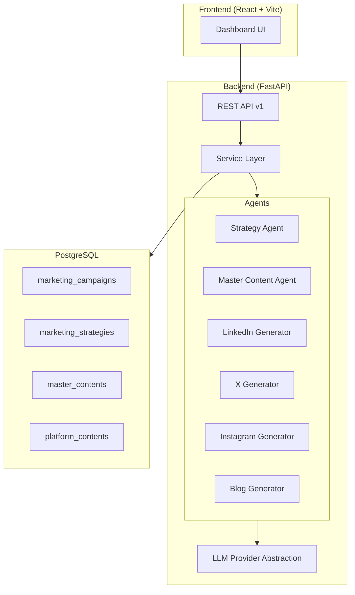
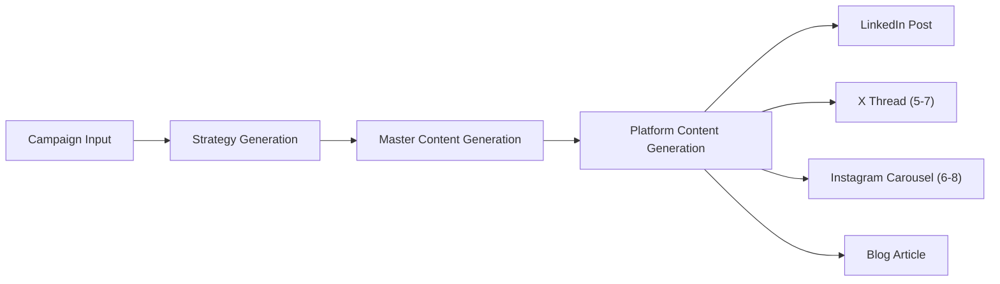
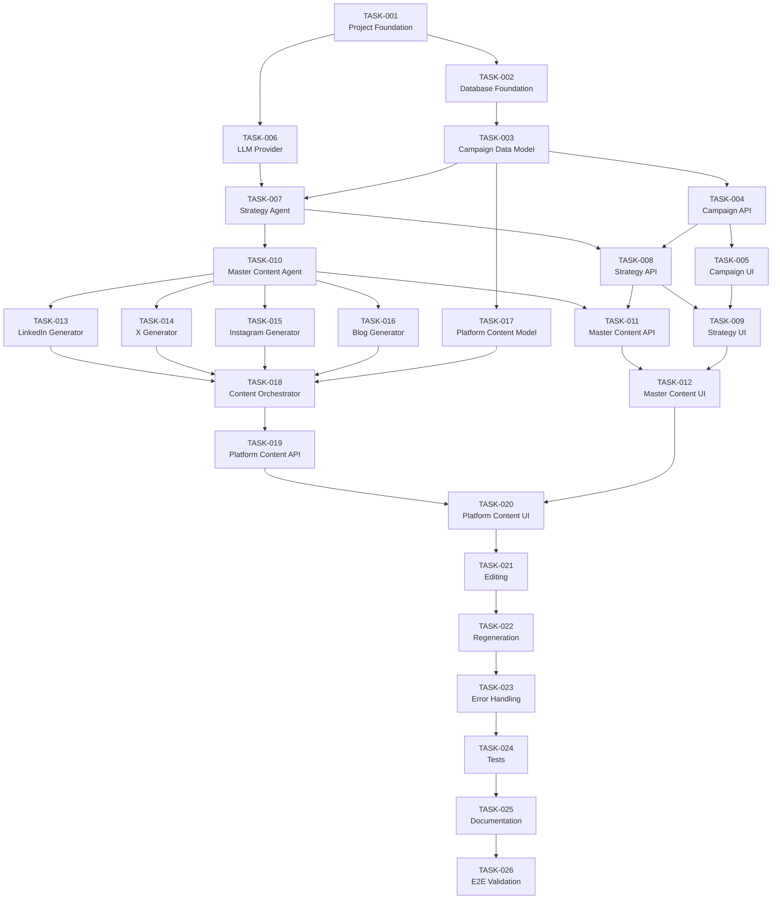

# AI Marketing Content Engine — Implementation Plan

## Architecture Summary

A **modular monolith** web application that generates AI-powered marketing content across multiple platforms (LinkedIn, X/Twitter, Instagram, Blog) from a single campaign brief.

### Tech Stack

| Layer | Technology |
|-------|-----------|
| **Backend** | Python 3.11+, FastAPI, Pydantic v2, SQLAlchemy 2.0 (async), Alembic |
| **Database** | PostgreSQL 15+ with JSONB columns |
| **Frontend** | Vite + React (TypeScript) with vanilla CSS |
| **LLM** | OpenAI-compatible API via abstraction layer |
| **Infrastructure** | Docker Compose (PostgreSQL + Backend + Frontend) |

### High-Level Architecture



### Data Flow



### Backend Package Structure

```
backend/
├── alembic/                    # Database migrations
├── app/
│   ├── main.py                 # FastAPI application entry
│   ├── config.py               # Settings via pydantic-settings
│   ├── database.py             # Async SQLAlchemy engine/session
│   ├── models/                 # SQLAlchemy ORM models
│   │   ├── campaign.py
│   │   ├── strategy.py
│   │   ├── master_content.py
│   │   └── platform_content.py
│   ├── schemas/                # Pydantic request/response schemas
│   │   ├── campaign.py
│   │   ├── strategy.py
│   │   ├── master_content.py
│   │   └── platform_content.py
│   ├── api/
│   │   └── v1/
│   │       ├── campaigns.py
│   │       ├── strategies.py
│   │       ├── master_content.py
│   │       └── platform_content.py
│   ├── services/               # Business logic orchestration
│   │   ├── campaign_service.py
│   │   ├── strategy_service.py
│   │   ├── content_service.py
│   │   └── content_orchestrator.py
│   ├── agents/                 # AI agents (one per responsibility)
│   │   ├── base.py
│   │   ├── strategy_agent.py
│   │   ├── master_content_agent.py
│   │   ├── linkedin_generator.py
│   │   ├── x_generator.py
│   │   ├── instagram_generator.py
│   │   └── blog_generator.py
│   └── llm/                    # LLM provider abstraction
│       ├── base.py
│       └── openai_provider.py
├── tests/
├── requirements.txt
├── Dockerfile
└── alembic.ini
```

### Frontend Structure

```
frontend/
├── src/
│   ├── main.tsx
│   ├── App.tsx
│   ├── index.css                # Design system tokens + global styles
│   ├── api/                     # API client functions
│   ├── components/              # Reusable UI components
│   ├── pages/                   # Route-level page components
│   │   ├── CampaignList.tsx
│   │   ├── CampaignCreate.tsx
│   │   ├── CampaignDetail.tsx
│   │   └── ContentView.tsx
│   └── types/                   # TypeScript interfaces
├── package.json
├── vite.config.ts
└── Dockerfile
```

---

## Design Decisions Requiring User Input

> [!IMPORTANT]
> ### 1. LLM Provider
> The abstraction layer is provider-agnostic, but the initial implementation needs a default provider. **Which LLM provider should be the default?**
> - **A. OpenAI API** (GPT-4o / GPT-4o-mini)
> - **B. OpenAI-compatible endpoint** (e.g., Azure OpenAI, vLLM, Ollama)
> - **C. Anthropic Claude**
> - **D. Google Gemini**
>
> **Recommendation:** Option A (OpenAI) since the spec mentions `LLM_BASE_URL` which aligns with the OpenAI client pattern and allows swapping to any compatible provider.

> [!IMPORTANT]
> ### 2. Frontend Framework
> The spec says "simple modern dashboard." Options:
> - **A. Vite + React (TypeScript)** — Fast, modern, great DX
> - **B. Vite + Vanilla JS** — Lighter, no framework overhead
>
> **Recommendation:** Option A — React provides component reusability and state management needed for the multi-step campaign workflow.

> [!IMPORTANT]
> ### 3. Structured LLM Output Strategy
> For parsing LLM responses into validated Pydantic models:
> - **A. Provider-native structured output** (e.g., OpenAI JSON mode / response_format) + Pydantic fallback validation
> - **B. Prompt-only JSON + post-hoc Pydantic validation + one retry on failure
>
> **Recommendation:** Option A with B as fallback — use native structured output when available, validate with Pydantic always, retry once on schema violations.

---

## Complete Task List

---

### TASK-001 — Project Foundation

**Objective:**
Set up the monorepo structure with backend (FastAPI) and frontend (Vite + React) skeletons, Docker Compose for local dev, and environment configuration.

**Dependencies:** None

**Expected Changes:**
- `backend/` — FastAPI app skeleton with `main.py`, `config.py`, `requirements.txt`, `Dockerfile`
- `frontend/` — Vite + React + TypeScript scaffold, `Dockerfile`
- `docker-compose.yml` — PostgreSQL + backend + frontend services
- `.env.example` — All environment variables documented
- `README.md` — Initial project documentation

**Validation:**
- `docker compose up` starts all three services
- Backend responds at `http://localhost:8000/health`
- Frontend loads at `http://localhost:3000`
- PostgreSQL is accessible

---

### TASK-002 — Database Foundation

**Objective:**
Configure async SQLAlchemy 2.0, set up Alembic for migrations, create the database connection layer.

**Dependencies:** TASK-001

**Expected Changes:**
- `backend/app/database.py` — Async engine, session factory, Base model
- `backend/alembic/` — Alembic configuration with async support
- `backend/alembic.ini` — Database URL from environment

**Validation:**
- Alembic initializes successfully
- Database connection established on startup
- Empty migration runs without errors

---

### TASK-003 — Campaign Data Model

**Objective:**
Create the `marketing_campaigns` SQLAlchemy model and Alembic migration with all fields from the spec (name, objective, industry, product, target audience, personas, pain points, offer, landing page, brand info, tone) plus status management.

**Dependencies:** TASK-002

**Expected Changes:**
- `backend/app/models/__init__.py`
- `backend/app/models/campaign.py` — SQLAlchemy model with UUID PK, JSONB fields, status enum
- `backend/app/schemas/campaign.py` — Pydantic schemas (Create, Update, Response)
- Alembic migration for `marketing_campaigns` table

**Validation:**
- Migration applies successfully
- Model fields match spec requirements
- Status enum includes: `draft`, `strategy_generation`, `strategy_generated`, `master_content_generation`, `master_content_generated`, `platform_content_generation`, `completed`, `failed`

---

### TASK-004 — Campaign API

**Objective:**
Implement full Campaign CRUD REST API endpoints.

**Dependencies:** TASK-003

**Expected Changes:**
- `backend/app/services/campaign_service.py` — CRUD business logic
- `backend/app/api/v1/campaigns.py` — REST endpoints
- `backend/app/api/v1/__init__.py` — Router registration
- `backend/app/main.py` — Mount v1 router

**Validation:**
- `POST /api/v1/campaigns` creates a campaign
- `GET /api/v1/campaigns` lists all campaigns
- `GET /api/v1/campaigns/{id}` returns one campaign
- `PATCH /api/v1/campaigns/{id}` updates a campaign
- `DELETE /api/v1/campaigns/{id}` deletes a campaign
- Proper error responses for 404, 422

---

### TASK-005 — Campaign UI

**Objective:**
Build the campaign creation form and campaign list dashboard in the frontend.

**Dependencies:** TASK-004

**Expected Changes:**
- `frontend/src/index.css` — Design system (tokens, colors, typography, animations)
- `frontend/src/api/client.ts` — API client with base URL config
- `frontend/src/api/campaigns.ts` — Campaign API functions
- `frontend/src/types/campaign.ts` — TypeScript interfaces
- `frontend/src/pages/CampaignList.tsx` — Campaign list/dashboard
- `frontend/src/pages/CampaignCreate.tsx` — Campaign creation form
- `frontend/src/pages/CampaignDetail.tsx` — Campaign detail view
- `frontend/src/App.tsx` — Routing setup
- `frontend/src/components/` — Shared UI components (Button, Input, Card, etc.)

**Validation:**
- Campaign list page displays all campaigns
- Create form submits all required fields
- Detail page shows full campaign data
- Responsive layout works on desktop and tablet
- UI matches premium design aesthetic

---

### TASK-006 — LLM Provider Abstraction

**Objective:**
Create the LLM provider interface and OpenAI-compatible implementation with structured output support.

**Dependencies:** TASK-001

**Expected Changes:**
- `backend/app/llm/base.py` — Abstract `LLMProvider` class with `generate_structured()` method
- `backend/app/llm/openai_provider.py` — OpenAI implementation using `httpx` or `openai` SDK
- `backend/app/llm/__init__.py` — Factory function to get provider from config
- `backend/app/config.py` — Add LLM settings (`LLM_API_KEY`, `LLM_BASE_URL`, `LLM_MODEL`)

**Validation:**
- Provider instantiates from environment config
- `generate_structured()` returns parsed Pydantic models
- Handles API errors gracefully
- Retry logic on transient failures

---

### TASK-007 — Strategy Agent

**Objective:**
Build the Strategy Agent that generates marketing strategy from campaign data.

**Dependencies:** TASK-006, TASK-003

**Expected Changes:**
- `backend/app/agents/base.py` — Base agent class
- `backend/app/agents/strategy_agent.py` — Strategy generation logic with system/user prompts
- `backend/app/schemas/strategy.py` — Pydantic schema for strategy output (audience_insights, content_pillars, key_messages, topics, content_angles, cta)

**Validation:**
- Agent produces valid strategy JSON matching the schema
- Pydantic validation catches malformed output
- One retry on validation failure
- Failed generation is reported, not silently dropped

---

### TASK-008 — Strategy Data Model & API

**Objective:**
Create `marketing_strategies` table and Strategy API endpoints.

**Dependencies:** TASK-007, TASK-004

**Expected Changes:**
- `backend/app/models/strategy.py` — SQLAlchemy model (UUID PK, campaign FK, JSONB content, status, timestamps)
- Alembic migration for `marketing_strategies`
- `backend/app/services/strategy_service.py` — Generate, retrieve, regenerate logic
- `backend/app/api/v1/strategies.py` — REST endpoints

**Validation:**
- `POST /api/v1/campaigns/{id}/strategy/generate` triggers generation and stores result
- `GET /api/v1/campaigns/{id}/strategy` returns stored strategy
- `POST /api/v1/campaigns/{id}/strategy/regenerate` creates a new strategy
- Campaign status updates to `strategy_generation` → `strategy_generated`

---

### TASK-009 — Strategy UI

**Objective:**
Add strategy display and generation controls to the campaign detail page.

**Dependencies:** TASK-008, TASK-005

**Expected Changes:**
- `frontend/src/api/strategies.ts` — Strategy API functions
- `frontend/src/types/strategy.ts` — TypeScript interfaces
- `frontend/src/components/StrategyView.tsx` — Strategy display component
- `frontend/src/pages/CampaignDetail.tsx` — Add strategy section
- Loading states, error handling, regenerate button

**Validation:**
- "Generate Strategy" button triggers generation
- Strategy content displays in structured, readable format
- Loading spinner during generation
- "Regenerate" button creates fresh strategy
- Error states display clearly

---

### TASK-010 — Master Content Agent

**Objective:**
Build the Master Content Agent that generates platform-neutral master content from campaign + strategy.

**Dependencies:** TASK-007

**Expected Changes:**
- `backend/app/agents/master_content_agent.py` — Master content generation with prompts
- `backend/app/schemas/master_content.py` — Pydantic schema (title, core_idea, problem, solution, business_value, target_personas, key_message, cta)

**Validation:**
- Agent produces valid master content JSON
- Output is platform-neutral (no platform-specific formatting)
- Schema validation with retry on failure

---

### TASK-011 — Master Content Data Model & API

**Objective:**
Create `master_contents` table and Master Content API endpoints.

**Dependencies:** TASK-010, TASK-008

**Expected Changes:**
- `backend/app/models/master_content.py` — SQLAlchemy model
- Alembic migration for `master_contents`
- `backend/app/services/content_service.py` — Generate, retrieve, regenerate logic
- `backend/app/api/v1/master_content.py` — REST endpoints

**Validation:**
- `POST /api/v1/campaigns/{id}/master-content/generate` triggers generation
- `GET /api/v1/campaigns/{id}/master-content` returns stored content
- `POST /api/v1/master-content/{id}/regenerate` regenerates
- Campaign status updates appropriately

---

### TASK-012 — Master Content UI

**Objective:**
Add master content display and controls to the campaign detail page.

**Dependencies:** TASK-011, TASK-009

**Expected Changes:**
- `frontend/src/api/masterContent.ts` — API functions
- `frontend/src/types/masterContent.ts` — TypeScript interfaces
- `frontend/src/components/MasterContentView.tsx` — Display component
- `frontend/src/pages/CampaignDetail.tsx` — Add master content section

**Validation:**
- "Generate Master Content" button triggers generation (only available after strategy exists)
- Master content displays in structured format
- Regenerate functionality works
- Step-by-step workflow enforced (can't skip strategy)

---

### TASK-013 — LinkedIn Content Generator

**Objective:**
Build the LinkedIn-specific content generator agent.

**Dependencies:** TASK-010

**Expected Changes:**
- `backend/app/agents/linkedin_generator.py` — LinkedIn post generation with B2B-optimized prompts
- `backend/app/schemas/platform_content.py` — LinkedIn-specific Pydantic schema (platform, content_type, content, hashtags, cta)

**Validation:**
- Generates professional B2B LinkedIn post
- Content follows master content messaging but uses LinkedIn-appropriate formatting
- Hashtags are relevant and properly formatted
- Schema validation passes

---

### TASK-014 — X/Twitter Content Generator

**Objective:**
Build the X/Twitter thread generator agent.

**Dependencies:** TASK-010

**Expected Changes:**
- `backend/app/agents/x_generator.py` — Thread generation (5-7 posts)
- `backend/app/schemas/platform_content.py` — X thread schema (platform, content_type, posts with position/content)

**Validation:**
- Generates 5-7 post thread
- Each post respects character limits
- Thread flows logically
- Schema validation passes

---

### TASK-015 — Instagram Content Generator

**Objective:**
Build the Instagram carousel generator agent.

**Dependencies:** TASK-010

**Expected Changes:**
- `backend/app/agents/instagram_generator.py` — Carousel generation (6-8 slides + caption)
- `backend/app/schemas/platform_content.py` — Instagram schema (slides with headline/body/visual, caption)

**Validation:**
- Generates 6-8 carousel slides
- Each slide has headline, body, and visual description
- Caption is Instagram-optimized
- Schema validation passes

---

### TASK-016 — Blog Content Generator

**Objective:**
Build the SEO-oriented blog article generator agent.

**Dependencies:** TASK-010

**Expected Changes:**
- `backend/app/agents/blog_generator.py` — Article generation with SEO structure
- `backend/app/schemas/platform_content.py` — Blog schema (title, meta_description, slug, keywords, sections, cta)

**Validation:**
- Generates full SEO article
- Has proper heading hierarchy
- Meta description and keywords are relevant
- Schema validation passes

---

### TASK-017 — Platform Content Data Model

**Objective:**
Create `platform_contents` table with support for all four platform types.

**Dependencies:** TASK-003

**Expected Changes:**
- `backend/app/models/platform_content.py` — SQLAlchemy model (UUID PK, master_content FK, platform enum, content_type, JSONB content, status)
- Alembic migration for `platform_contents`

**Validation:**
- Migration applies successfully
- Supports all four platforms (linkedin, x, instagram, blog)
- JSONB content column stores platform-specific structures
- Status enum: `pending`, `generating`, `completed`, `failed`

---

### TASK-018 — Content Orchestrator

**Objective:**
Build the orchestration service that coordinates parallel platform content generation with failure isolation.

**Dependencies:** TASK-013, TASK-014, TASK-015, TASK-016, TASK-017

**Expected Changes:**
- `backend/app/services/content_orchestrator.py` — Orchestrates all four generators
- Independent execution per platform
- Failure in one platform doesn't affect others
- Status tracking per platform

**Validation:**
- All four platforms generate independently
- If one fails, others still complete
- Status accurately reflects per-platform state
- Campaign status updates to `completed` (or `failed` if all fail)

---

### TASK-019 — Platform Content API

**Objective:**
Create REST API endpoints for platform content generation, retrieval, editing, and regeneration.

**Dependencies:** TASK-018

**Expected Changes:**
- `backend/app/api/v1/platform_content.py` — REST endpoints
- `backend/app/services/content_service.py` — Add platform content operations

**Validation:**
- `POST /api/v1/master-content/{id}/platform-content/generate` triggers all generators
- `GET /api/v1/master-content/{id}/platform-content` returns all platform content
- `POST /api/v1/platform-content/{id}/regenerate` regenerates single platform
- `PATCH /api/v1/platform-content/{id}` edits content
- Failure isolation works (one platform failure doesn't block others)

---

### TASK-020 — Platform Content UI

**Objective:**
Build the platform content display with tabbed interface (LinkedIn, X, Instagram, Blog) and edit/regenerate controls.

**Dependencies:** TASK-019, TASK-012

**Expected Changes:**
- `frontend/src/api/platformContent.ts` — API functions
- `frontend/src/types/platformContent.ts` — TypeScript interfaces
- `frontend/src/components/PlatformTabs.tsx` — Tabbed platform navigation
- `frontend/src/components/LinkedInView.tsx` — LinkedIn post display
- `frontend/src/components/XThreadView.tsx` — X thread display
- `frontend/src/components/InstagramView.tsx` — Instagram carousel display
- `frontend/src/components/BlogView.tsx` — Blog article display
- `frontend/src/pages/CampaignDetail.tsx` — Add platform content section

**Validation:**
- Tab switching between platforms
- Each platform renders its content appropriately
- Failed platforms show error state with retry button
- Generate button triggers all platform generation

---

### TASK-021 — Content Editing

**Objective:**
Add inline editing capabilities for all content types (strategy, master content, platform content).

**Dependencies:** TASK-020

**Expected Changes:**
- `frontend/src/components/EditableContent.tsx` — Generic editable content component
- Update all content view components to support edit mode
- Save/Cancel/Discard controls
- API integration for PATCH endpoints

**Validation:**
- Users can edit any content field
- Changes save via API
- Cancel discards unsaved changes
- Edit mode is visually distinct

---

### TASK-022 — Independent Regeneration

**Objective:**
Enable independent regeneration of any single platform's content without affecting others.

**Dependencies:** TASK-021

**Expected Changes:**
- Frontend regenerate buttons per platform
- Backend handles single-platform regeneration
- Status updates only for the regenerated platform
- Version tracking (optional — store previous content)

**Validation:**
- Regenerating LinkedIn doesn't affect X, Instagram, Blog
- Loading state appears only for regenerating platform
- New content replaces old content
- Status updates correctly

---

### TASK-023 — Error Handling & Edge Cases

**Objective:**
Comprehensive error handling across the full stack — API errors, LLM failures, validation errors, network issues.

**Dependencies:** TASK-022

**Expected Changes:**
- `backend/app/api/error_handlers.py` — Global exception handlers
- Frontend error boundary components
- Toast/notification system for user feedback
- Retry logic refinement
- Rate limit handling

**Validation:**
- Invalid campaign data returns 422 with field-level errors
- LLM timeout shows appropriate error message
- Network failures show retry option
- No unhandled exceptions in logs

---

### TASK-024 — Automated Tests

**Objective:**
Write comprehensive test suite covering all critical paths.

**Dependencies:** TASK-023

**Expected Changes:**
- `backend/tests/test_campaigns.py` — Campaign CRUD tests
- `backend/tests/test_strategy.py` — Strategy generation tests
- `backend/tests/test_master_content.py` — Master content tests
- `backend/tests/test_platform_generators.py` — All four generator tests
- `backend/tests/test_orchestrator.py` — Orchestration and failure isolation
- `backend/tests/test_schemas.py` — Schema validation tests
- `backend/tests/test_api.py` — API endpoint integration tests
- `backend/tests/conftest.py` — Test fixtures, mock LLM provider

**Validation:**
- All tests pass
- LLM calls are mocked (no real API calls in tests)
- Coverage for critical paths (CRUD, generation, validation, failure isolation)

---

### TASK-025 — Documentation

**Objective:**
Complete project documentation including README, API docs, architecture guide, and setup instructions.

**Dependencies:** TASK-024

**Expected Changes:**
- `README.md` — Project overview, quick start, features
- `docs/ARCHITECTURE.md` — System architecture documentation
- `docs/API.md` — Complete API reference
- `docs/SETUP.md` — Local development and Docker instructions
- `docs/ENVIRONMENT.md` — Environment variable reference

**Validation:**
- A new developer can set up the project from README alone
- API docs cover all endpoints with request/response examples
- Architecture doc explains the agent pattern and data flow

---

### TASK-026 — Final End-to-End Validation

**Objective:**
Complete end-to-end test of the full workflow: create campaign → generate strategy → generate master content → generate all platform content → edit → regenerate.

**Dependencies:** TASK-025

**Expected Changes:**
- `backend/tests/test_e2e.py` — End-to-end workflow test
- Bug fixes discovered during E2E testing
- Final polish

**Validation:**
- Full workflow completes without errors
- All content types generate valid output
- Editing and regeneration work correctly
- UI workflow is smooth and intuitive
- Docker Compose brings up the complete system
- All tests pass

---

## Dependency Graph



### Linear Execution Order

```
TASK-001  Project Foundation
    ↓
TASK-002  Database Foundation
    ↓
TASK-003  Campaign Data Model
    ↓
TASK-004  Campaign API
    ↓
TASK-005  Campaign UI
    ↓
TASK-006  LLM Provider Abstraction
    ↓
TASK-007  Strategy Agent
    ↓
TASK-008  Strategy Data Model & API
    ↓
TASK-009  Strategy UI
    ↓
TASK-010  Master Content Agent
    ↓
TASK-011  Master Content Data Model & API
    ↓
TASK-012  Master Content UI
    ↓
TASK-013  LinkedIn Content Generator
    ↓
TASK-014  X/Twitter Content Generator
    ↓
TASK-015  Instagram Content Generator
    ↓
TASK-016  Blog Content Generator
    ↓
TASK-017  Platform Content Data Model
    ↓
TASK-018  Content Orchestrator
    ↓
TASK-019  Platform Content API
    ↓
TASK-020  Platform Content UI
    ↓
TASK-021  Content Editing
    ↓
TASK-022  Independent Regeneration
    ↓
TASK-023  Error Handling & Edge Cases
    ↓
TASK-024  Automated Tests
    ↓
TASK-025  Documentation
    ↓
TASK-026  Final End-to-End Validation
```

---

## Summary of Files Changed Per Task

| Task | Key Files |
|------|-----------|
| 001 | `docker-compose.yml`, `backend/`, `frontend/`, `.env.example`, `README.md` |
| 002 | `backend/app/database.py`, `backend/alembic/` |
| 003 | `backend/app/models/campaign.py`, `backend/app/schemas/campaign.py`, migration |
| 004 | `backend/app/services/campaign_service.py`, `backend/app/api/v1/campaigns.py` |
| 005 | `frontend/src/pages/`, `frontend/src/components/`, `frontend/src/index.css` |
| 006 | `backend/app/llm/base.py`, `backend/app/llm/openai_provider.py` |
| 007 | `backend/app/agents/strategy_agent.py`, `backend/app/schemas/strategy.py` |
| 008 | `backend/app/models/strategy.py`, `backend/app/api/v1/strategies.py`, migration |
| 009 | `frontend/src/components/StrategyView.tsx`, `frontend/src/api/strategies.ts` |
| 010 | `backend/app/agents/master_content_agent.py`, `backend/app/schemas/master_content.py` |
| 011 | `backend/app/models/master_content.py`, `backend/app/api/v1/master_content.py`, migration |
| 012 | `frontend/src/components/MasterContentView.tsx`, `frontend/src/api/masterContent.ts` |
| 013 | `backend/app/agents/linkedin_generator.py` |
| 014 | `backend/app/agents/x_generator.py` |
| 015 | `backend/app/agents/instagram_generator.py` |
| 016 | `backend/app/agents/blog_generator.py` |
| 017 | `backend/app/models/platform_content.py`, migration |
| 018 | `backend/app/services/content_orchestrator.py` |
| 019 | `backend/app/api/v1/platform_content.py` |
| 020 | `frontend/src/components/PlatformTabs.tsx`, platform view components |
| 021 | `frontend/src/components/EditableContent.tsx`, content view updates |
| 022 | Frontend regenerate buttons, backend single-platform regeneration |
| 023 | `backend/app/api/error_handlers.py`, frontend error boundaries |
| 024 | `backend/tests/` — all test files |
| 025 | `docs/` — all documentation files |
| 026 | `backend/tests/test_e2e.py`, final fixes |
